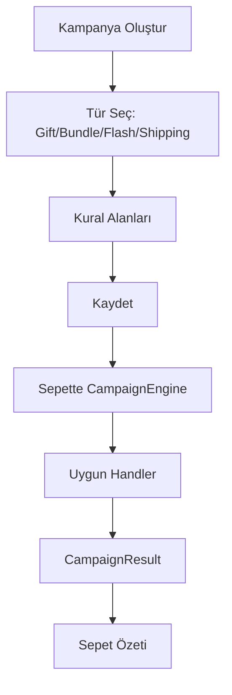

## Campaign Flows (Kampanya Akışları)

Kısa özet: Strategy pattern tabanlı kampanya motoru; X Al Y Hediye, Paket İndirim, Flash İndirim, Ücretsiz Kargo türlerini destekler. Sepet bağlamına göre uygun kampanyaları uygular, sonuçları değer nesneleriyle döner.

- [Özet Akış](#özet-akış)
- [Detaylı Akış Adımları](#detaylı-akış-adımları)
- [Mimari ve Dosya Yapısı](#mimari-ve-dosya-yapısı)
- [Senaryolar](#senaryolar)
 - [Etkilenen Dosyalar ve File Structure](#etkilenen-dosyalar-ve-file-structure)
 - [Mermaid Akış Diyagramı](#mermaid-akış-diyagramı)
 - [Mimariler, Desenler, Prensipler](#mimariler-desenler-prensipler)

---

## Özet Akış

- Sepet bağlamı (items, toplam, müşteri tipi) hazırlanır.
- `CampaignEngine` aktif kampanyaları bulur, türüne göre handler seçer, uygular.
- Sonuçlar indirim/hediye/mesaj içeren `CampaignResult` nesneleri olarak döner.

---

## Detaylı Akış Adımları

1) Aktif kampanyaları getir → müşteri tipi/ tarih/ durum filtreleri.
2) Türüne göre handler seç → `supports` kontrolü.
3) Uygula → indirim/hediye hesapla, limitlere uy.
4) Sonuçları optimize et → stackable/priority kuralları.
5) Kullanım takibini kaydet.

---

## Mimari ve Dosya Yapısı

```text
app/
  Services/Campaign/
    CampaignEngine.php               # Orkestrasyon
    Handlers/                        # Tür bazlı stratejiler
      BuyXGetYFreeHandler.php
      BundleDiscountHandler.php
      FlashSaleHandler.php
      FreeShippingHandler.php
  Enums/Campaign/CampaignType.php    # Tür enumu
  ValueObjects/Campaign/             # Sonuç ve bağlam VO'ları
    CampaignResult.php
    CartContext.php
```

---

## Senaryolar

- “3 Al 1 Hediye”: 3+ tetikleyici ürün varsa 1 hediye eklenir.
- “Paket %20 İndirim”: seçili paket ürün toplamına %20 indirim.
- “Flash %50”: belirli zaman aralığında tüm ürünlerde %50.
- “500₺ Üzeri Kargo Bedava”: sepet toplamı eşik üstünde ise ücretsiz kargo.

---

## Etkilenen Dosyalar ve File Structure

```text
app/
  Services/Campaign/
    CampaignEngine.php
    Handlers/*                     # Tür bazlı handler'lar
  ValueObjects/Campaign/
    CampaignResult.php
    CartContext.php
  Models/Campaign.php
  Filament/Resources/CampaignResource/*
```

---

## Mermaid Akış Diyagramı



---

## Mimariler, Desenler, Prensipler

- Strategy: Tür başına ayrı handler.
- Value Object: Sonuçlar ve bağlam immutable nesnelerle taşınır.
- Koordinasyon: Engine, öncelik/stacking kurallarıyla sonuçları optimize eder.


