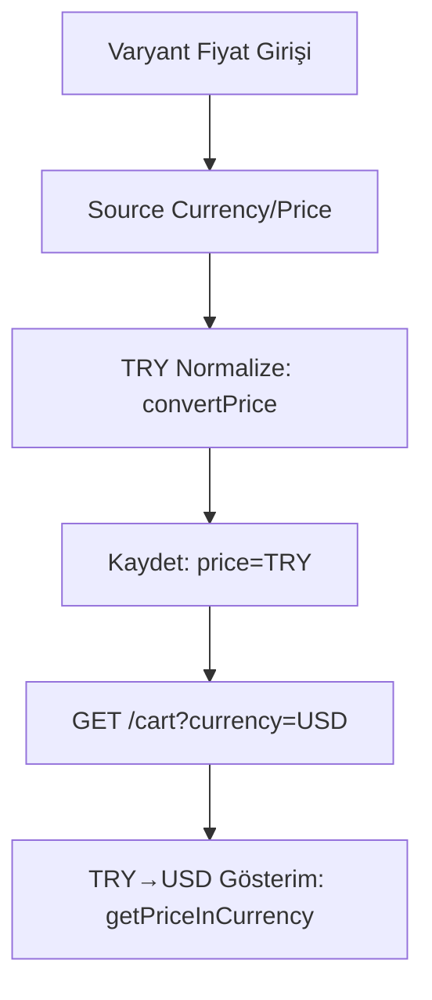

## Currency & Exchange Flows (Para Birimi ve Kur Akışları)

Kısa özet: Ürün/varyant fiyatları TRY normalize edilerek saklanır; kaynak para birimi bilgilerinden (source) dönüştürülür. Görüntüleme tarafında hedef para birimine dönüştürme yapılır. TCMB entegrasyonu ve fallback kurlar desteklidir.

- [Özet Akış](#özet-akış)
- [Detaylı Adımlar](#detaylı-adımlar)
- [Mimari ve Dosya Yapısı](#mimari-ve-dosya-yapısı)
- [Senaryolar](#senaryolar)
- [Checklist](#checklist)
 - [Mermaid Akış Diyagramı](#mermaid-akış-diyagramı)
 - [Mimariler, Desenler, Prensipler](#mimariler-desenler-prensipler)

---

## Özet Akış

- Varyant formunda `source_currency` + `source_price` girilir.
- TRY normalize `price` hesaplanır ve kaydedilir.
- İstemciye dönerken hedef `currency`’ye dönüştürme yapılır.

---

## Detaylı Adımlar

1) Varyant fiyatı, girilen para biriminden (ör. USD/EUR) otomatik olarak TL karşılığına çevrilir ve sistemde bu TL değeri saklanır.
2) Müşteri arayüzünde görüntülerken, istenen para birimine (ör. USD) anlık olarak çevrilerek gösterilir.
3) Döviz kurları TCMB’den düzenli aralıklarla güncellenir; gerekirse panelden manuel güncelleme yapılabilir.
4) TCMB geçici olarak yanıt vermezse, sistem makul “yedek” oranlarla hesaplayarak kullanıcı deneyimini kesintiye uğratmaz.

---

## Teknik Detaylar ve Dosya Yapısı

```text
app/
  Services/
    CurrencyConversionService.php   # Dönüşüm hesapları
    ExchangeRateService.php         # TCMB entegrasyonu/cache
  Filament/Resources/CurrencyResource.php  # Admin yönetimi
  Models/Currency.php               # Semboller, convertTo yardımcıları
```

---

## Senaryolar

- USD kaynaklı varyant: 100 USD → 3050 TRY (ör.) → vitrin USD/EUR gösterimi.
- TCMB servis hatası: fallback oranlarla hesaplama, kullanıcıya bilgilendirici mesaj.

---

## Checklist

- [ ] Kaynak fiyatlar düzgün normalize ediliyor (TRY)
- [ ] Gösterim dönüşümleri doğru
- [ ] TCMB cache ve hata toleransı çalışıyor

---

## Mermaid Akış Diyagramı



---

## Mimariler, Desenler, Prensipler

- Normalize saklama: Persist her zaman TRY; gösterim dönüşümle.
- Hata toleransı: TCMB hatasında fallback oranlar.
- Tek sorumluluk: Dönüşüm hesapları `CurrencyConversionService`, oran yönetimi `ExchangeRateService`.


