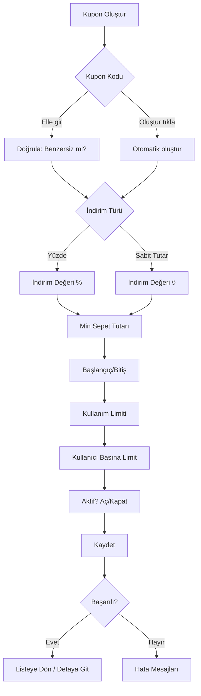
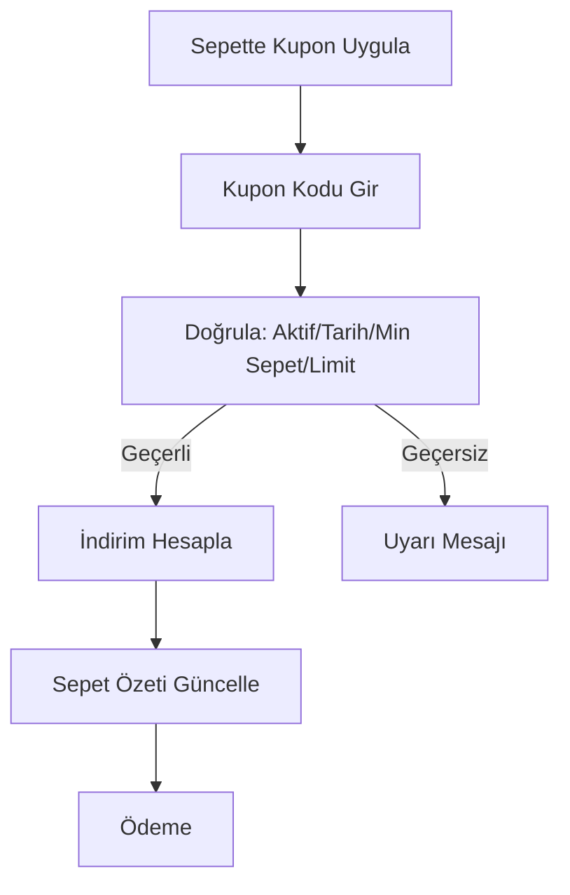

## Coupon Flows (İndirim Kuponları)

Kısa özet: Filament panelde “İndirim Kuponları” kaynağı üzerinden, kodu kendin girerek veya otomatik oluşturarak kupon tanımlarsın. İndirim türü (Yüzde/Sabit Tutar), değer, minimum sepet, başlangıç/bitiş ve kullanım limitleri gibi alanlar pratik akışlarla yönetilir.

- [Hızlı Kullanım](#hızlı-kullanım)
- [Örnek Senaryolar](#örnek-senaryolar)
- [İleri Seçenekler](#ileri-seçenekler)
- [İlgili Dosyalar](#ilgili-dosyalar)
 - [Etkilenen Dosyalar ve File Structure](#etkilenen-dosyalar-ve-file-structure)
 - [Mimariler, Desenler, Prensipler](#mimariler-desenler-prensipler)

---

## Hızlı Kullanım

- Kupon Kodu: Elle yaz veya “Oluştur” düğmesiyle otomatik üret.
- İndirim Türü: “Yüzde” veya “Sabit Tutar”.
- İndirim Değeri: Türle uyumlu değeri yaz (örn. %5 ya da 100₺).
- Minimum Sepet Tutarı: Kuponun geçerli olması için alt sınır.
- Başlangıç/Bitiş Tarihi: Geçerlilik aralığı.
- Kullanım Limiti: Kuponun toplam kullanım sayısı.
- Kullanıcı Başına Limit: Her kullanıcı için maksimum kullanım.
- Aktif: Anında devreye almak için aç/kapat.

---

## Örnek Senaryolar

- Yüzde indirim (temel):
  - Kupon Kodu: boş bırak → “Oluştur” tıkla
  - İndirim Türü: Yüzde
  - İndirim Değeri: 5
  - Minimum Sepet Tutarı: 500₺
  - Başlangıç/Bitiş: bugün → +30 gün
  - Kullanım Limiti: 100
  - Kullanıcı Başına Limit: 1
  - Aktif: Aç

- Sabit tutar kuponu (kampanya bitiş tarihli):
  - Kupon Kodu: “YILSONU-100”
  - İndirim Türü: Sabit Tutar
  - İndirim Değeri: 100
  - Minimum Sepet Tutarı: 0
  - Başlangıç/Bitiş: 01.12 → 31.12
  - Kullanım Limiti: 1000
  - Kullanıcı Başına Limit: 5
  - Aktif: Aç

- İlk alışverişe özel (katı limitli):
  - Kupon Kodu: “ILK-ALIŞVERİŞ”
  - İndirim Türü: Yüzde
  - İndirim Değeri: 10
  - Minimum Sepet Tutarı: 250₺
  - Kullanım Limiti: 1
  - Kullanıcı Başına Limit: 1
  - Başlangıç/Bitiş: bugün → +7 gün
  - Aktif: Aç

- Büyük sepet teşviki (yüksek eşik):
  - Kupon Kodu: “3K-15”
  - İndirim Türü: Yüzde
  - İndirim Değeri: 15
  - Minimum Sepet Tutarı: 3000₺
  - Kullanım Limiti: 200
  - Kullanıcı Başına Limit: 2
  - Aktif: Aç

- Hızlı stok temizliği (kısa süreli):
  - Kupon Kodu: otomatik oluştur
  - İndirim Türü: Sabit Tutar
  - İndirim Değeri: 50
  - Minimum Sepet Tutarı: 200₺
  - Başlangıç/Bitiş: bugün → +48 saat
  - Kullanım Limiti: 300
  - Aktif: Aç

---

## İleri Seçenekler

- Geçerlilik Penceresi: Gece 00:00/23:59 sınırlarına dikkat ederek tarih aralığı belirle.
- Müşteri Tipi Hedefleme (varsa): B2B/B2C segmentine göre kuponu sınırlama.
- Kampanya ile Birlikte Kullanım (stacking): Proje kuralına göre birlikte kullanım politikasını kontrol et.
- Raporlama: Kullanım sayısı ve dönüşümü, kupon detay sayfasından takip et.

---

## İlgili Dosyalar

- Filament: `app/Filament/Resources/DiscountCouponResource/*`
- API (varsa): `app/Http/Controllers/Api/CouponController.php`
- Dokümantasyon: `documents/workflows/campaign-flows.md`

---

## Etkilenen Dosyalar ve File Structure

```text
app/
  Filament/Resources/
    DiscountCouponResource.php          # Kupon form/tablo, oluştur düğmesi, tür & değer alanları
    DiscountCouponResource/Pages/*      # List/Create/Edit sayfaları
  Http/Controllers/Api/
    CouponController.php                # (Varsa) kupon doğrulama/uygulama uçları
  Models/
    DiscountCoupon.php                  # Kupon temel model ve ilişkiler
  Services/
    CampaignPricingService.php          # Sepet fiyatlamasına kupon/kampanya etkileri köprüsü
    Cart/CartPriceCoordinator.php       # Sepette kupon indirimlerinin yansıtılması
  Policies/
    DiscountCouponPolicy.php            # (Varsa) panel yetkileri

documents/
  workflows/coupon-flows.md             # Bu dosya
  workflows/campaign-flows.md           # Kampanya akışları (birlikte kullanım politikaları)
```

---

## Mimariler, Desenler, Prensipler

- Admin odaklı kaynak (Filament Resource): Form bileşenleriyle sade akış; “Kodu Oluştur”, “İndirim Türü (Yüzde/Sabit)” gibi alanlarla konuşur.
- Servis katmanı entegrasyonu: Kuponun sepete uygulanması `CartPriceCoordinator`/`CampaignPricingService` üzerinden koordine edilir.
- Validasyon: Panel form validasyonu + (varsa) API tarafında FormRequest ile giriş doğrulama.
- Yetkilendirme: Spatie Permission + (varsa) `DiscountCouponPolicy` ile görünürlük/aksiyon izni.
- Basit kurallar → okunabilirlik: DB alan isimleri yerine panel input isimleri kullanılır (Kupon Kodu, İndirim Türü, İndirim Değeri, Min. Sepet Tutarı, Başlangıç/Bitiş, Limitler, Aktif).

---

## Mermaid Akış Diyagramı






